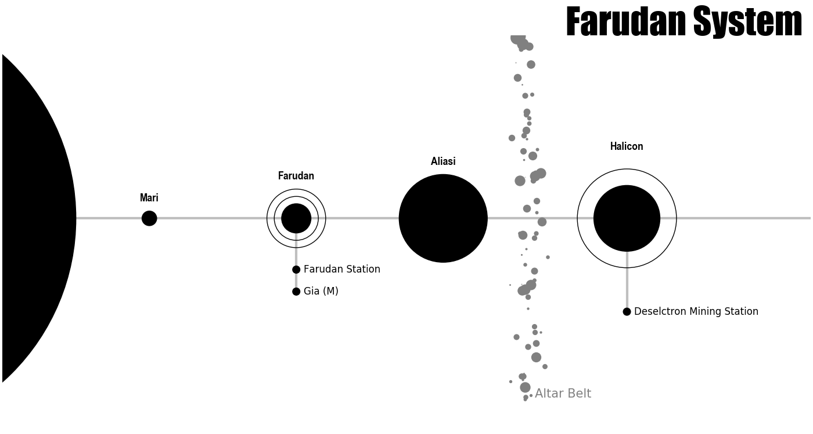
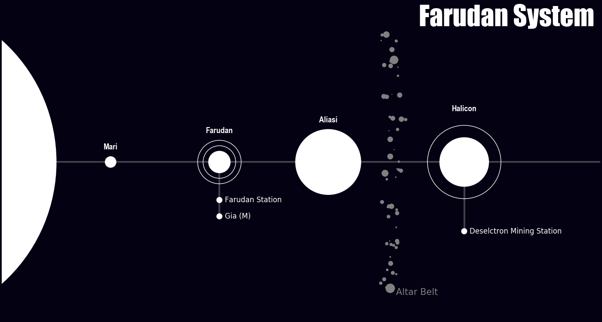

# planetary system generator (psg.py)
A quick script for generating (stylized) maps of planetary systems, supporting asteroid belts and orbitals (moons, stations) around planets.

[You can access the online interactive generator here](https://prappleizer-planetary-system-gene-planetary-system-maker-z2ftry.streamlitapp.com/)

Alternatively, you can also use the tool offline. Simply clone this directory and head into the `offline_version/` directory. 

## Requirements
- numpy
- matplotlib
- pyyaml

## Usage

In `offline_version/`, you will find `psg.py`, along with a sample `config.yml`. 

The yml file looks like this: 
```yml 
name: Farudan System
planets:
  Farudan:
    dist: 40
    size: 2 
    orbitals:
      - Farudan Station
      - Gia (M)
  Aliasi:
    dist: 60
    size: 6
  Mari: 
    dist: 20
    size: 1
  Halicon:
    dist: 85
    size: 4.5
    orbitals:
      - Deselctron Mining Station

asteroid_belts:
  Altar Belt:
    dist: 71
    width: 1.1
    density: high

```
Which is fairly self explanatory -- system name, then planets with their distance (out of 100), size (between 0.5 and ~10 work well), and orbitals (i.e., anything orbiting them you wish to name: moons, space stations, etc). Finally, asteroid belts (if desired), with name and distance, along with width (sigma) and density of rocks (low medium or high). I find widths of ~1-2 work. 

To run, simply run 
```
python psg.py config.yml
```
for whatever you have saved your config filename as. There are optional arguments as well. By default, it will save an image to the current directory of the form `System_Name.png`. You can change both the name and/or the extension via, e.g.,:
```
python psg.py config.yml --output=new_name --extension=pdf
``` 

And lastly, we have two styles of presentation: dark mode and light mode. You can set these via the style argument:
```
python psg.py config.yml --style=dark
```
Here's an example of the output for light:


As well as for Dark mode:


And that's it! Comments and suggestions welcome.
